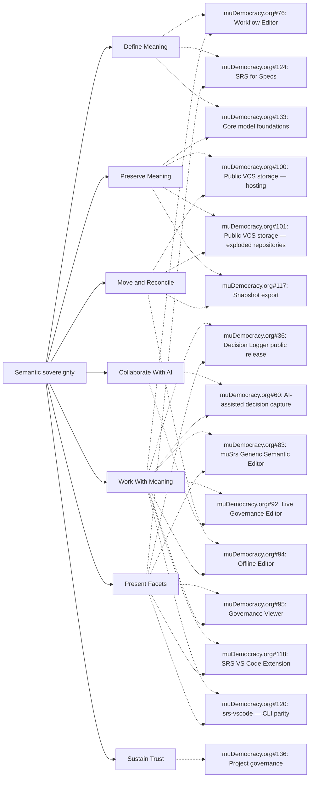
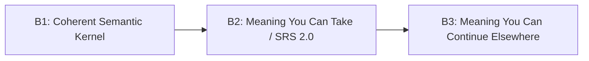
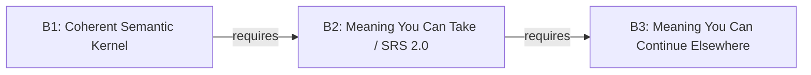

# SRS owner strategic map

> Generated from `roadmap.json` by `node scripts/gh-project.mjs strategy --write`. Do not edit this file directly.

An owner operating view above the execution board. It preserves release intent while GitHub issues carry delivery detail.

This is the owner operating view above the execution board. It names durable capability branches and release promises; it does not change GitHub hierarchy, labels, priorities or release fields.

## Capability map

Delivery surfaces across all branches: Web, VS Code, CLI, WASM.

| Capability | Primary epics / workstreams |
| --- | --- |
| Define Meaning | [#76](https://github.com/the-greenman/muDemocracy.org/issues/76) Workflow Editor [#124](https://github.com/the-greenman/muDemocracy.org/issues/124) SRS for Specs [#133](https://github.com/the-greenman/muDemocracy.org/issues/133) Core model foundations |
| Preserve Meaning | [#100](https://github.com/the-greenman/muDemocracy.org/issues/100) Public VCS storage — hosting [#101](https://github.com/the-greenman/muDemocracy.org/issues/101) Public VCS storage — exploded repositories [#117](https://github.com/the-greenman/muDemocracy.org/issues/117) Snapshot export [#133](https://github.com/the-greenman/muDemocracy.org/issues/133) Core model foundations |
| Work With Meaning | [#36](https://github.com/the-greenman/muDemocracy.org/issues/36) Decision Logger public release [#60](https://github.com/the-greenman/muDemocracy.org/issues/60) AI-assisted decision capture [#76](https://github.com/the-greenman/muDemocracy.org/issues/76) Workflow Editor [#83](https://github.com/the-greenman/muDemocracy.org/issues/83) muSrs Generic Semantic Editor [#92](https://github.com/the-greenman/muDemocracy.org/issues/92) Live Governance Editor [#94](https://github.com/the-greenman/muDemocracy.org/issues/94) Offline Editor [#95](https://github.com/the-greenman/muDemocracy.org/issues/95) Governance Viewer [#118](https://github.com/the-greenman/muDemocracy.org/issues/118) SRS VS Code Extension [#120](https://github.com/the-greenman/muDemocracy.org/issues/120) srs-vscode — CLI parity |
| Present Facets | [#36](https://github.com/the-greenman/muDemocracy.org/issues/36) Decision Logger public release [#83](https://github.com/the-greenman/muDemocracy.org/issues/83) muSrs Generic Semantic Editor [#95](https://github.com/the-greenman/muDemocracy.org/issues/95) Governance Viewer [#118](https://github.com/the-greenman/muDemocracy.org/issues/118) SRS VS Code Extension [#120](https://github.com/the-greenman/muDemocracy.org/issues/120) srs-vscode — CLI parity [#124](https://github.com/the-greenman/muDemocracy.org/issues/124) SRS for Specs |
| Move and Reconcile | [#94](https://github.com/the-greenman/muDemocracy.org/issues/94) Offline Editor [#100](https://github.com/the-greenman/muDemocracy.org/issues/100) Public VCS storage — hosting [#101](https://github.com/the-greenman/muDemocracy.org/issues/101) Public VCS storage — exploded repositories [#117](https://github.com/the-greenman/muDemocracy.org/issues/117) Snapshot export |
| Collaborate With AI | [#60](https://github.com/the-greenman/muDemocracy.org/issues/60) AI-assisted decision capture [#92](https://github.com/the-greenman/muDemocracy.org/issues/92) Live Governance Editor |
| Sustain Trust | [#136](https://github.com/the-greenman/muDemocracy.org/issues/136) Project governance |

## Release staircase

### B1 — Coherent Semantic Kernel

**Actor:** A maintainer of a first-party SRS package

**Promise:** One authoritative semantic model can be migrated and regenerated without silent meaning loss.

**Durable artifact:** A migrated first-party corpus with generated conformance evidence.

**Entry criteria:** Epic #256 has an agreed closure checklist; First-party corpus inventory is known

**Included capabilities:** Define Meaning, Preserve Meaning, Present Facets

**Root issues:** [#256](https://github.com/the-greenman/srs/issues/256), [#133](https://github.com/the-greenman/muDemocracy.org/issues/133)

**Explicit exclusions:** Independent portable archive; Offline reintegration; Runtime AI ratification

**End-to-end walkthrough:** Regenerate the first-party corpus from the authoritative model, validate it with independent Node and Rust paths, and inspect the same canonical state through more than one DocumentView.

**Compatibility promise:** The migrated kernel has one source of truth; generated projections are reproducible from it.

**What becomes stable:** Core model identity, reference resolution and regeneration invariants are stable enough to build outward.

### B2 — Meaning You Can Take / SRS 2.0

**Actor:** An independent user with no access to the originating service

**Promise:** A Decision Logger export can be opened, validated, understood and rendered offline as a self-contained semantic repository.

**Durable artifact:** A portable .srs archive plus a generic offline-readable rendering and conformance proof.

**Entry criteria:** B1 conformance evidence is green; Archive completeness and version-closure acceptance tests are defined

**Included capabilities:** Define Meaning, Preserve Meaning, Present Facets, Move and Reconcile

**Root issues:** [#117](https://github.com/the-greenman/muDemocracy.org/issues/117), [#124](https://github.com/the-greenman/muDemocracy.org/issues/124), [#375](https://github.com/the-greenman/srs/issues/375)

**Explicit exclusions:** Editing and reintegration; Cryptographic authority profiles; Federation negotiation

**End-to-end walkthrough:** Export a Decision Logger repository, disconnect from the originating service, then open it in a generic reader that recovers definitions, records, relations, provenance and a readable facet while accurately reporting any missing evidence.

**Compatibility promise:** Frozen publications resolve their declared version closure reproducibly; their canonical state is independent of the presentation View.

**What becomes stable:** The public SRS standard boundary: Evolution gives way to Continuity by default.

### B3 — Meaning You Can Continue Elsewhere

**Actor:** A collaborator continuing work from a clone or export

**Promise:** A user can edit offline, inspect the semantic diff and reintegrate without losing identity, relations, provenance or unsupported content.

**Durable artifact:** A reintegrated repository with a reviewable semantic diff and preserved unsupported-content diagnostics.

**Entry criteria:** B2 portable archive walkthrough passes; Semantic diff and reintegration conflict model are specified

**Included capabilities:** Preserve Meaning, Work With Meaning, Move and Reconcile, Sustain Trust

**Root issues:** [#94](https://github.com/the-greenman/muDemocracy.org/issues/94), [#100](https://github.com/the-greenman/muDemocracy.org/issues/100), [#101](https://github.com/the-greenman/muDemocracy.org/issues/101)

**Explicit exclusions:** Cross-community federation; AI meeting runtime; Third-party authoring UX beyond the interchange contract

**End-to-end walkthrough:** Clone or export a repository, make an offline change, inspect the semantic diff, and reintegrate it while verifying record identities, relations, provenance and opaque extensions remain intact.

**Compatibility promise:** Interchange does not silently discard data a conforming reader cannot interpret; it preserves or diagnoses it.

**What becomes stable:** Offline continuation and reintegration form a reliable cross-installation collaboration boundary.

## Critical path

Only release-gate `requires` edges appear here. Native `blocked-by` edges are intentionally live-only and are shown by `strategy --status`; conceptual relationships never enter the scheduler graph.

## Epic disposition (proposal only)

No GitHub hierarchy, label, priority or release-field change is implied by this table.

| Epic | Proposed disposition | Proposed role | Rationale |
| --- | --- | --- | --- |
| [#36](https://github.com/the-greenman/muDemocracy.org/issues/36) Decision Logger public release | keep release | candidate outcome release | R1 shipped; later Decision Logger outcomes remain independently releasable. |
| [#60](https://github.com/the-greenman/muDemocracy.org/issues/60) AI-assisted decision capture | keep release | candidate outcome release | Sequenced after preservation proof; not a B1–B3 gate. |
| [#76](https://github.com/the-greenman/muDemocracy.org/issues/76) Workflow Editor | keep release | candidate outcome release | A human authoring surface, not the semantic kernel. |
| [#83](https://github.com/the-greenman/muDemocracy.org/issues/83) muSrs Generic Semantic Editor | keep release | candidate outcome release | Validates semantic editing and inspection, including provenance work. |
| [#92](https://github.com/the-greenman/muDemocracy.org/issues/92) Live Governance Editor | keep release | candidate outcome release | A governance-product outcome after the portable core is proven. |
| [#94](https://github.com/the-greenman/muDemocracy.org/issues/94) Offline Editor | keep release | candidate outcome release | Primary B3 outcome and reintegration proof. |
| [#95](https://github.com/the-greenman/muDemocracy.org/issues/95) Governance Viewer | keep release | candidate outcome release | A readable user-facing facet of durable governance meaning. |
| [#100](https://github.com/the-greenman/muDemocracy.org/issues/100) Public VCS storage — hosting | demote to workstream | preservation and offline-reintegration workstream | Supports B3 rather than defining a standalone product release. |
| [#101](https://github.com/the-greenman/muDemocracy.org/issues/101) Public VCS storage — exploded repositories | reparent | preservation and offline-reintegration workstream | Supports B3 alongside archive and semantic-diff work. |
| [#117](https://github.com/the-greenman/muDemocracy.org/issues/117) Snapshot export | keep release | candidate outcome release | Principal B2 portable-archive outcome. |
| [#118](https://github.com/the-greenman/muDemocracy.org/issues/118) SRS VS Code Extension | demote to workstream | cross-cutting delivery workstream | Supports authoring and inspection releases; delivery surface, not a capability branch. |
| [#120](https://github.com/the-greenman/muDemocracy.org/issues/120) srs-vscode — CLI parity | merge | VS Code delivery workstream | Proposed merge into the cross-cutting VS Code workstream. |
| [#124](https://github.com/the-greenman/muDemocracy.org/issues/124) SRS for Specs | keep release | candidate outcome release | Contributes the spec-authoring package and B2 standard convergence. |
| [#133](https://github.com/the-greenman/muDemocracy.org/issues/133) Core model foundations | demote to workstream | standards-convergence gate | B1/B2 convergence work, not a separate product release. |
| [#136](https://github.com/the-greenman/muDemocracy.org/issues/136) Project governance | demote to workstream | Sustain Trust workstream | Keeps purpose, principles and decisions inspectable across releases. |

## Use

- Regenerate after changing the curated model: `node scripts/gh-project.mjs strategy --write`.
- Verify committed output: `node scripts/gh-project.mjs strategy --check`.
- Overlay live GitHub state without changing committed files: `node scripts/gh-project.mjs strategy --status`.
